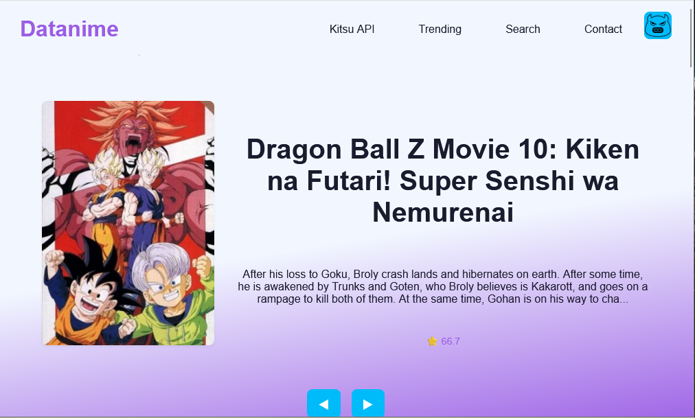
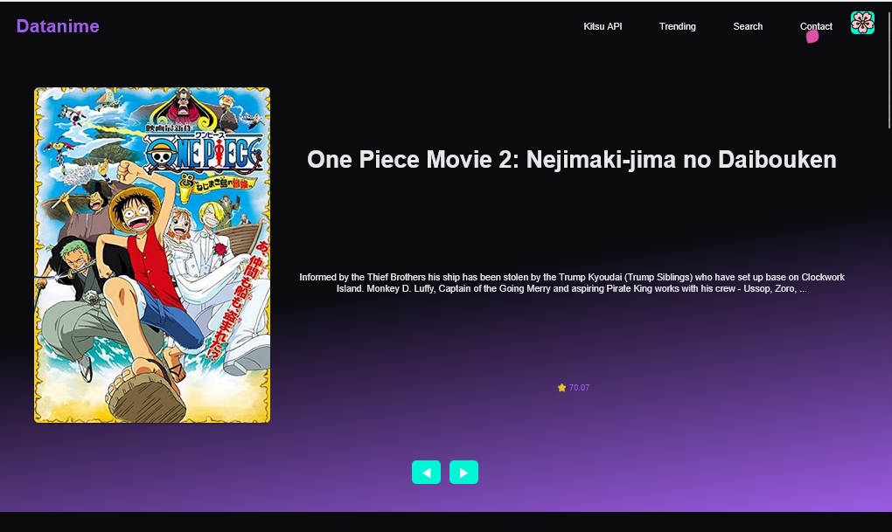
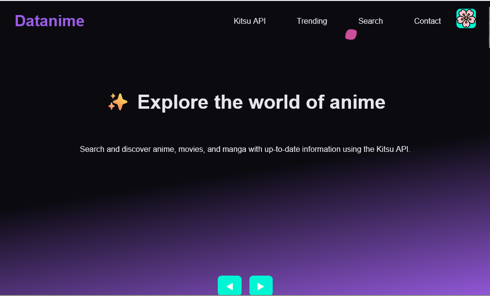
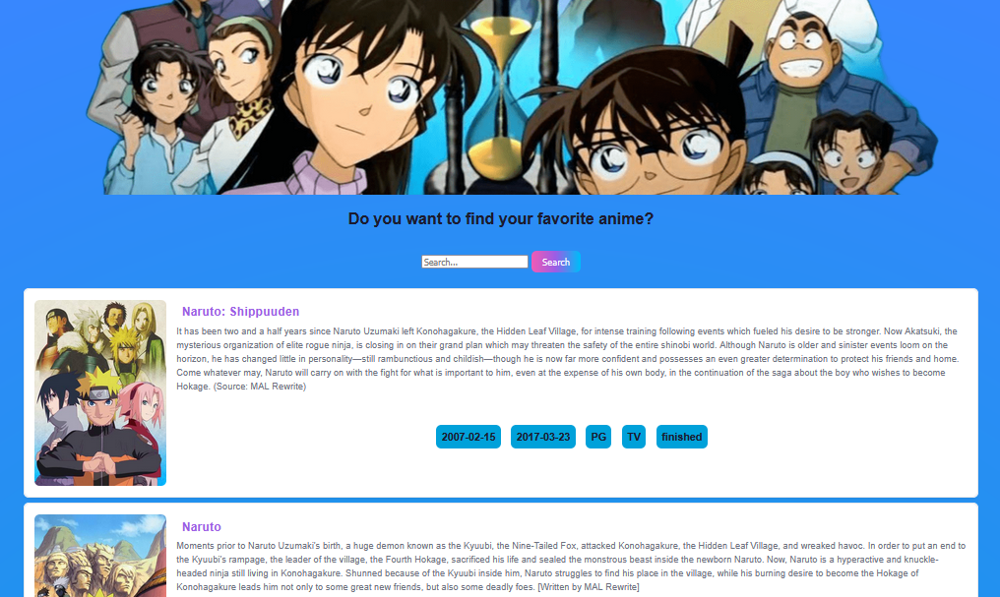
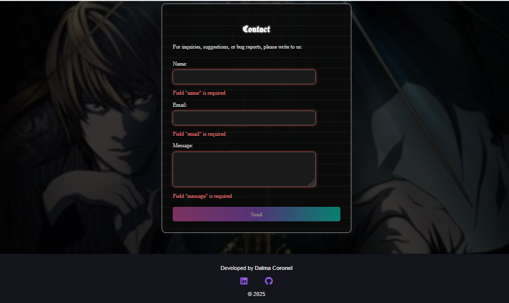

# 🌸 Datanime

**Datanime** es una página web interactiva que permite explorar y buscar información sobre animes y mangas utilizando la API pública de [Kitsu](https://kitsu.docs.apiary.io/).

> Proyecto desarrollado con **HTML**, **CSS** y **JavaScript puro**, sin frameworks ni librerías externas.

---

## ✨ Características

- 🔍 **Buscador de animes y mangas** por nombre (usando la API de Kitsu)
- 🎠 **Carrusel automático** de animes aleatorios al cargar la página
- 🌗 **Modo claro / oscuro** con toggle visual temático (waifus)
- 💌 **Formulario de contacto** con validación en tiempo real (inspirado en *Death Note*)
- 💎 **Diseño responsive** adaptable a dispositivos móviles y escritorio
- 🎨 **Estética anime**, con fondos, íconos y colores inspirados en el estilo otaku

---

## 🛠️ Tecnologías usadas

- **HTML5**
- **CSS3** (custom properties, layout responsive)
- **JavaScript** (DOM, fetch API, validaciones)

---

## 📡 API utilizada

Se utiliza la [API pública de Kitsu](https://kitsu.docs.apiary.io/#reference/anime) para obtener información actualizada sobre animes y mangas.

---

## 📷 Capturas de pantalla

### 🏠 Página principal

### 🔍 Sección de búsqueda

### ✉️ Formulario de contacto

